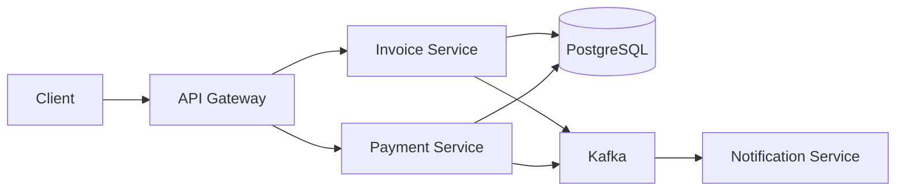

# Documentation Standards

## 1. Purpose

These standards ensure consistent, comprehensive, and maintainable documentation across the ERP SaaS platform. Good documentation is essential for onboarding, maintenance, and knowledge sharing.

## 2. Documentation Principles

- **Audience-aware:** Write for the intended reader
- **Up-to-date:** Documentation matches code
- **Discoverable:** Easy to find and navigate
- **Actionable:** Include examples and how-tos
- **Concise:** Clear and to the point
- **Living:** Updated with code changes

## 3. Documentation Types

### 3.1 Documentation Matrix

| Type | Audience | Location | Format | Update Frequency |
|------|----------|----------|--------|-----------------|
| README | Developers, Users | Root of repo | Markdown | With each release |
| Architecture | Architects, Developers | docs/architecture/ | Markdown | With ADRs |
| API Docs | API Consumers | docs/api/ | OpenAPI | With each change |
| Runbooks | On-call, DevOps | docs/runbooks/ | Markdown | With each change |
| ADRs | Architects, Developers | docs/architecture/adr/ | Markdown | With decisions |
| Code Comments | Developers | In code | Javadoc | With code changes |
| Changelog | Users, Developers | CHANGELOG.md | Markdown | With each release |

## 4. README Standards

### 4.1 Project README

```markdown
# ERP AI Platform

## Overview
Brief description of the platform.

## Features
- Feature 1
- Feature 2
- Feature 3

## Tech Stack
- Java 17
- Spring Boot 3.2
- PostgreSQL 15
- Kafka
- Keycloak

## Prerequisites
- Java 17+
- Docker & Docker Compose
- Gradle 8.5+

## Quick Start

### 1. Clone Repository
```bash
git clone https://github.com/company/erp-ai-platform.git
cd erp-ai-platform
```

### 2. Start Infrastructure
```bash
docker-compose up -d postgres redis kafka keycloak
```

### 3. Run Application
```bash
./gradlew bootRun
```

### 4. Access Application
- API: http://localhost:8080/api/v1
- Swagger UI: http://localhost:8080/swagger-ui.html
- Keycloak: http://localhost:8081

## Documentation
- [Architecture](./docs/architecture/)
- [API Reference](./docs/api/)
- [Development Guide](./docs/development/)
- [Runbooks](./docs/runbooks/)

## Contributing
See [CONTRIBUTING.md](./CONTRIBUTING.md)

## License
See [LICENSE](./LICENSE)
```

### 4.2 Module README

```markdown
# Finance Module

## Overview
The finance module handles invoicing, payments, and accounting.

## Features
- Invoice creation and management
- Payment processing
- Accounts receivable
- Financial reporting

## API Endpoints
- `POST /api/v1/invoices` - Create invoice
- `GET /api/v1/invoices/{id}` - Get invoice
- `GET /api/v1/invoices` - List invoices
- `POST /api/v1/invoices/{id}/payments` - Record payment

## Dependencies
- platform-core
- libraries-common
- libraries-data
- integration-events

## Database
- Schema: `tenant_{id}`
- Tables: `invoices`, `payments`, `invoice_line_items`

## Events Published
- `InvoiceCreatedEvent`
- `InvoicePaidEvent`
- `InvoiceCancelledEvent`

## Events Consumed
- `PaymentProcessedEvent`
- `CustomerDeactivatedEvent`
```

## 5. Architecture Documentation

### 5.1 System Architecture

```markdown
# System Architecture

## Overview
High-level architecture of the ERP platform.

## Architecture Diagram
[Insert diagram]

## Components
### API Gateway
- Routes requests to services
- Handles authentication
- Rate limiting

### Services
- Finance Service
- HR Service
- Inventory Service
- Sales Service

### Data Layer
- PostgreSQL (primary)
- Redis (cache)
- Kafka (messaging)

### Infrastructure
- Kubernetes
- Keycloak (auth)
- MinIO (storage)

## Data Flow
[Describe data flow]

## Deployment Architecture
[Link to deployment architecture]
```

### 5.2 Domain Model

```markdown
# Domain Model

## Bounded Contexts
### Finance
- Invoice
- Payment
- Account

### HR
- Employee
- Payroll
- Attendance

### Inventory
- Product
- Stock
- Warehouse

## Relationships
[Describe relationships between contexts]

## Event Flow
[Describe event flow between contexts]
```

## 6. API Documentation

### 6.1 OpenAPI Specification

```yaml
# docs/api/openapi.yaml
openapi: 3.0.3
info:
  title: ERP AI Platform API
  description: REST API for ERP AI Platform
  version: 1.0.0
  contact:
    name: API Support
    email: api@company.com

servers:
  - url: https://api.erp-platform.com/v1
    description: Production server
  - url: http://localhost:8080/api/v1
    description: Development server

security:
  - BearerAuth: []

paths:
  /invoices:
    post:
      summary: Create invoice
      operationId: createInvoice
      tags:
        - Invoices
      requestBody:
        required: true
        content:
          application/json:
            schema:
              $ref: '#/components/schemas/CreateInvoiceRequest'
      responses:
        '201':
          description: Invoice created
          content:
            application/json:
              schema:
                $ref: '#/components/schemas/InvoiceResponse'
        '400':
          $ref: '#/components/responses/BadRequest'
        '401':
          $ref: '#/components/responses/Unauthorized'
        '422':
          $ref: '#/components/responses/ValidationError'

components:
  schemas:
    CreateInvoiceRequest:
      type: object
      required:
        - customerId
        - total
        - currency
        - dueDate
      properties:
        customerId:
          type: integer
          format: int64
        total:
          type: string
          format: decimal
        currency:
          type: string
          pattern: '^[A-Z]{3}$'
        dueDate:
          type: string
          format: date
        lineItems:
          type: array
          items:
            $ref: '#/components/schemas/InvoiceLineItemRequest'
    
    InvoiceResponse:
      type: object
      properties:
        id:
          type: integer
          format: int64
        invoiceNumber:
          type: string
        total:
          type: string
          format: decimal
        status:
          type: string
          enum: [PENDING, APPROVED, PAID, CANCELLED, OVERDUE]
    
    InvoiceLineItemRequest:
      type: object
      required:
        - description
        - quantity
        - unitPrice
      properties:
        description:
          type: string
        quantity:
          type: integer
          format: int32
        unitPrice:
          type: string
          format: decimal

  responses:
    BadRequest:
      description: Bad request
      content:
        application/json:
          schema:
            $ref: '#/components/schemas/ErrorResponse'
    
    Unauthorized:
      description: Unauthorized
      content:
        application/json:
          schema:
            $ref: '#/components/schemas/ErrorResponse'
    
    ValidationError:
      description: Validation error
      content:
        application/json:
          schema:
            $ref: '#/components/schemas/ErrorResponse'

  schemas:
    ErrorResponse:
      type: object
      properties:
        error:
          type: object
          properties:
            code:
              type: string
            message:
              type: string
            details:
              type: object
            requestId:
              type: string
            timestamp:
              type: string
              format: date-time

  securitySchemes:
    BearerAuth:
      type: http
      scheme: bearer
      bearerFormat: JWT
```

### 6.2 API Documentation Requirements

- **Every endpoint:** Must have description, parameters, request/response examples
- **Error responses:** Document all possible error codes
- **Authentication:** Document required scopes/roles
- **Examples:** Provide realistic request/response examples
- **Versioning:** Document version and deprecation policy

## 7. Runbooks

### 7.1 Runbook Template

```markdown
# Runbook: {Title}

## Overview
Brief description of the runbook.

## Severity
- P1 - Critical (system down)
- P2 - High (major feature broken)
- P3 - Medium (minor issue)
- P4 - Low (cosmetic)

## Symptoms
How to identify this issue.

## Impact
What is affected and how severely.

## Diagnosis
Steps to diagnose the issue.

### Step 1: Check Service Health
```bash
curl http://localhost:8080/actuator/health
```

### Step 2: Check Logs
```bash
kubectl logs -l app=invoice-service --tail=100
```

### Step 3: Check Metrics
[Link to Grafana dashboard]

## Resolution
Steps to resolve the issue.

### Option 1: Restart Service
```bash
kubectl rollout restart deployment/invoice-service
```

### Option 2: Rollback Deployment
```bash
kubectl rollout undo deployment/invoice-service
```

## Verification
How to verify the issue is resolved.

## Escalation
When and how to escalate.

## Related
- [Monitoring Dashboard](link)
- [Alert Rule](link)
- [Related Runbook](link)
```

### 7.2 Common Runbooks

- Service restart procedure
- Database failover
- Kafka topic recovery
- Certificate renewal
- Data backup/restore
- Incident response

## 8. Code Documentation

### 8.1 Javadoc Standards

```java
/**
 * Service for managing invoices.
 * 
 * <p>This service handles invoice creation, retrieval, and payment processing.
 * All operations are tenant-aware and enforce business rules.
 * 
 * @author John Doe
 * @since 1.0.0
 */
@Service
@RequiredArgsConstructor
public class InvoiceService {
    
    private final InvoiceRepository invoiceRepository;
    private final PaymentService paymentService;
    
    /**
     * Creates a new invoice.
     * 
     * <p>This method validates the request, creates the invoice,
     * and publishes an {@link InvoiceCreatedEvent}.
     * 
     * @param request the invoice creation request
     * @return the created invoice response
     * @throws ValidationException if the request is invalid
     * @throws DuplicateInvoiceException if invoice number already exists
     * @throws CustomerNotFoundException if customer doesn't exist
     */
    public InvoiceResponse create(CreateInvoiceRequest request) {
        // Implementation
    }
    
    /**
     * Retrieves an invoice by ID.
     * 
     * @param tenantId the tenant ID
     * @param invoiceId the invoice ID
     * @return the invoice response
     * @throws ResourceNotFoundException if invoice not found
     */
    public InvoiceResponse getById(Long tenantId, Long invoiceId) {
        // Implementation
    }
}
```

### 8.2 Package Documentation

```java
/**
 * Finance module application layer.
 * 
 * <p>This package contains:
 * <ul>
 *   <li>Command handlers for write operations</li>
 *   <li>Query handlers for read operations</li>
 *   <li>DTOs for request/response mapping</li>
 *   <li>Mappers for DTO to domain conversion</li>
 * </ul>
 * 
 * @see com.erp.platform.business.finance.domain
 * @see com.erp.platform.business.finance.infrastructure
 */
package com.erp.platform.business.finance.application;
```

## 9. ADR Documentation

### 9.1 ADR Template

See [ADR Standard](./01-architecture-decision-records.md) for template.

### 9.2 ADR Index

```markdown
# Architecture Decision Records Index

| ADR | Title | Status | Date |
|-----|-------|--------|------|
| 001 | Use PostgreSQL as Primary Database | Accepted | 2024-01-15 |
| 002 | Multi-Tenant Data Isolation Strategy | Accepted | 2024-01-15 |
| 003 | Event-Driven Architecture with Kafka | Accepted | 2024-01-20 |
```

## 10. Changelog

### 10.1 Format

```markdown
# Changelog

All notable changes to this project will be documented in this file.

The format is based on [Keep a Changelog](https://keepachangelog.com/en/1.0.0/),
and this project adheres to [Semantic Versioning](https://semver.org/spec/v2.0.0.html).

## [Unreleased]

### Added
- New feature X (ERP-123)

### Changed
- Updated dependency Y to version Z

### Deprecated
- Feature A (will be removed in v2.0.0)

### Removed
- Removed deprecated feature B

### Fixed
- Bug fix C (ERP-456)

### Security
- Security fix D (ERP-789)

## [1.2.0] - 2024-01-15

### Added
- Invoice PDF generation (ERP-123)
- Barcode scanning support (ERP-124)

### Fixed
- Negative stock prevention (ERP-456)
- JWT filter null token handling (ERP-457)

[Unreleased]: https://github.com/company/erp-platform/compare/v1.2.0...HEAD
[1.2.0]: https://github.com/company/erp-platform/compare/v1.1.0...v1.2.0
```

## 11. Documentation Tools

### 11.1 Recommended Tools

| Tool | Purpose | Usage |
|------|---------|-------|
| Markdown | All documentation | Primary format |
| Mermaid | Diagrams | Architecture, flowcharts |
| PlantUML | UML diagrams | Class, sequence diagrams |
| Swagger/OpenAPI | API docs | Auto-generated from code |
| Javadoc | Code docs | Auto-generated from code |
| MkDocs | Documentation site | Static site generation |
| Docusaurus | Documentation site | React-based docs |

### 11.2 Diagrams



## 12. Documentation Checklist

- [ ] README present and up-to-date
- [ ] Architecture documented
- [ ] API documented (OpenAPI)
- [ ] Runbooks for critical operations
- [ ] ADRs for architectural decisions
- [ ] Code has Javadoc for public APIs
- [ ] Changelog maintained
- [ ] Diagrams included where helpful
- [ ] Examples provided
- [ ] Documentation reviewed with code

## 13. Documentation Review

- **Code review:** Documentation changes reviewed with code
- **Technical writer:** Complex docs reviewed by technical writer
- **User testing:** User-facing docs tested with users
- **Regular updates:** Documentation audited quarterly
